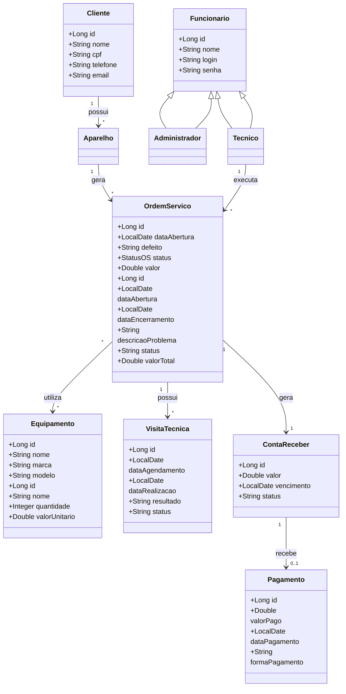

# Modelo de Dados

## 📊 Diagrama de Classes usando Mermaid


---

### Descrição das Entidades

Entidade       |	Descrição   |
-------------- |  ------------ |
Cliente	       | Entidade que representa um cliente do sistema. Contém informações cadastrais: nome, endereco, contato.|
Funcionário	   | Especialização de funcionário para técnico. Contém dados como nome, cpf, contato, salario, data_admissao, horario_expediente e status.|
Técnico        | Especialização de FUNCIONARIO para técnicos especializados.|
Administrador  | Especialização de FUNCIONARIO para administradores do sistema.|
Aparelho       | Entidade que representa os aparelhos dos clientes que serão reparados. Contém informações técnicas: tipo, marca, modelo, numero_serie, cor, observacoes e cliente_id e status.|
Ordem_Serviço  | Entidade central que representa uma ordem de serviço aberta para reparo. Contém id, data_abertura, data_encerramento, descricao_problema, status, valor_total, cliente_id, tecnico_id e aparelho_id.|
Equipamento	   | Entidade que representa insumos, ferramentas ou peças do estoque da assistência.|
Visita_Técnica | Entidade que representa visitas realizadas por técnicos na residência do cliente. Contém data_agendamento, data_realizacao, resultado, os_id e tecnico_id e status. |
Conta_Receber  | Entidade que representa as obrigações financeiras geradas pelas ordens de serviço. |
Pagamento      | Representa o ato do pagamento em si (transação, comprovante, processamento). Uma CONTA_RECEBER gerar um PAGAMENTO. |

---

#  Entidade Cliente

## Descrição

A entidade Cliente representa uma pessoa que solicita serviços de manutenção de equipamentos. Cada cliente poderá possuir um ou mais equipamentos cadastrados no sistema.

---

## Atributos

| Atributo | Tipo   | Descrição                      |
| -------- | ------ | ------------------------------ |
| id       | Long   | Identificador único do cliente |
| nome     | String | Nome completo do cliente       |
| cpf      | String | CPF do cliente                 |
| telefone | String | Telefone para contato          |
| email    | String | E-mail do cliente              |

---

## Regras de Negócio

O CPF deve ser único no sistema.
O nome do cliente é obrigatório.
O telefone é obrigatório.
O e-mail deve possuir formato válido.

---

## Critérios de Aceitação

* [ ] Criar a classe Cliente.
* [ ] Implementar os atributos especificados.
* [ ] Configurar chave primária (`id`).
* [ ] Configurar CPF como único.
* [ ] Implementar validações básicas.
* [ ] Criar construtores.
* [ ] Criar getters e setters.
* [ ] Criar testes unitários.

---

## Implementação Java

```java
package br.ufrn.assistenciatecnica.model;

import jakarta.persistence.*;
import jakarta.validation.constraints.Email;
import jakarta.validation.constraints.NotBlank;

@Entity
@Table(name = "clientes")
public class Cliente {

    @Id
    @GeneratedValue(strategy = GenerationType.IDENTITY)
    private Long id;

    @NotBlank
    @Column(nullable = false)
    private String nome;

    @Column(unique = true, nullable = false)
    private String cpf;

    @NotBlank
    @Column(nullable = false)
    private String telefone;

    @Email
    private String email;

    public Cliente() {
    }

    public Cliente(Long id, String nome, String cpf,
                   String telefone, String email) {
        this.id = id;
        this.nome = nome;
        this.cpf = cpf;
        this.telefone = telefone;
        this.email = email;
    }

    public Long getId() {
        return id;
    }

    public void setId(Long id) {
        this.id = id;
    }

    public String getNome() {
        return nome;
    }

    public void setNome(String nome) {
        this.nome = nome;
    }

    public String getCpf() {
        return cpf;
    }

    public void setCpf(String cpf) {
        this.cpf = cpf;
    }

    public String getTelefone() {
        return telefone;
    }

    public void setTelefone(String telefone) {
        this.telefone = telefone;
    }

    public String getEmail() {
        return email;
    }

    public void setEmail(String email) {
        this.email = email;
    }
}
```

---


