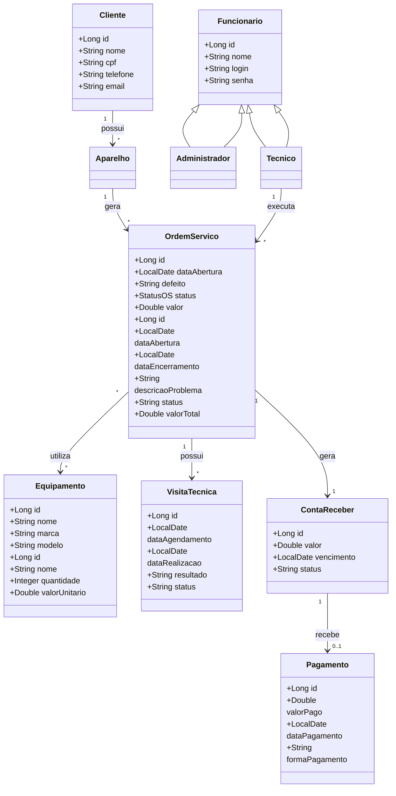

# Modelo de Dados

## 📊 Diagrama de Classes usando Mermaid

---

### Descrição das Entidades

Entidade       |	Descrição   |
-------------- |  ------------ |
Cliente	       | Entidade que representa um cliente do sistema. Contém informações cadastrais: nome, endereco, contato.|
Funcionário	   | Especialização de funcionário para técnico. Contém dados como nome, cpf, contato, salario, data_admissao, horario_expediente e status.|
Técnico        | Especialização de FUNCIONARIO para técnicos especializados.|
Administrador  | Especialização de FUNCIONARIO para administradores do sistema.|
Aparelho       | Entidade que representa os aparelhos dos clientes que serão reparados. Contém informações técnicas: tipo, marca, modelo, numero_serie, cor, observacoes e cliente_id e status.|
Ordem_Serviço  | Entidade central que representa uma ordem de serviço aberta para reparo. Contém id, data_abertura, data_encerramento, descricao_problema, status, valor_total, cliente_id, tecnico_id e aparelho_id.|
Equipamento	   | Entidade que representa insumos, ferramentas ou peças do estoque da assistência.|
Visita_Técnica | Entidade que representa visitas realizadas por técnicos na residência do cliente. Contém data_agendamento, data_realizacao, resultado, os_id e tecnico_id e status. |
Conta_Receber  | Entidade que representa as obrigações financeiras geradas pelas ordens de serviço. |
Pagamento      | Representa o ato do pagamento em si (transação, comprovante, processamento). Uma CONTA_RECEBER gerar um PAGAMENTO. |

---
