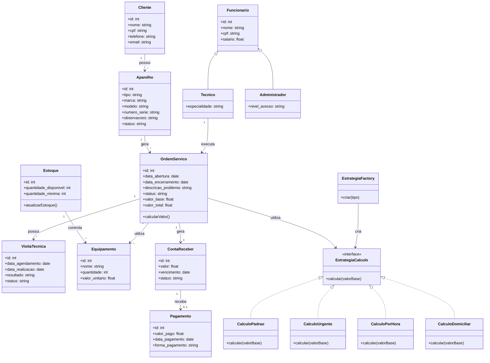
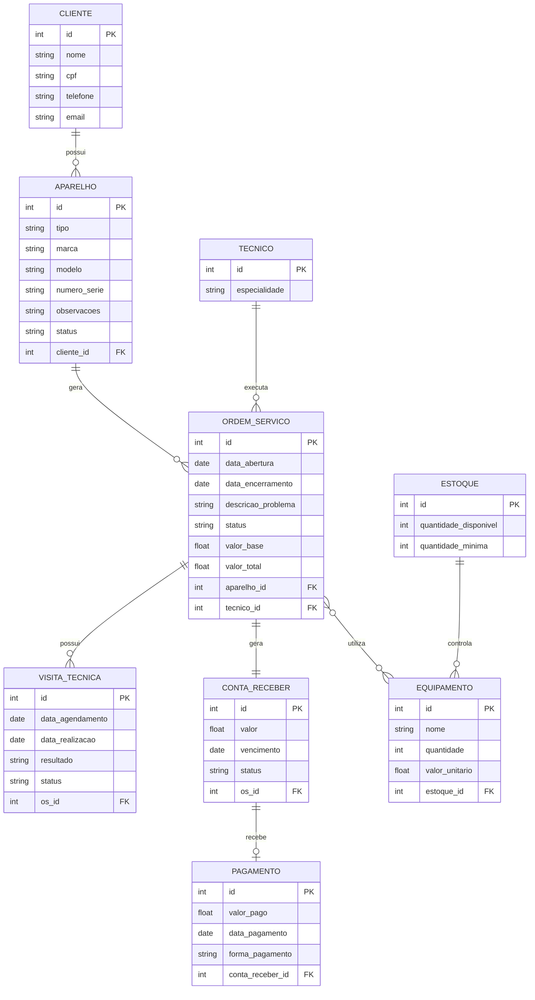

# Diagrama de Classes

### Descrição das Entidades

Entidade       |	Descrição   |
-------------- |  ------------ |
Cliente	       | Entidade que representa um cliente do sistema. Contém informações cadastrais: nome, endereco, contato.|
Funcionário	   | Especialização de funcionário para técnico. Contém dados como nome, cpf, contato, salario, data_admissao, horario_expediente e status.|
Técnico        | Especialização de FUNCIONARIO para técnicos especializados.|
Administrador  | Especialização de FUNCIONARIO para administradores do sistema.|
Aparelho       | Entidade que representa os aparelhos dos clientes que serão reparados. Contém informações técnicas: tipo, marca, modelo, numero_serie, cor, observacoes e cliente_id e status.|
Ordem_Serviço  | Entidade central que representa uma ordem de serviço aberta para reparo. Contém id, data_abertura, data_encerramento, descricao_problema, status, valor_total, cliente_id, tecnico_id e aparelho_id.|
Equipamento	   | Entidade que representa insumos, ferramentas ou peças do estoque da assistência.|
Estoque        | A entidade Estoque representa o controle de materiais, peças e equipamentos disponíveis na assistência técnica. Contém id, quantidade_disponivel e quantidade_minima.|
Visita_Técnica | Entidade que representa visitas realizadas por técnicos na residência do cliente. Contém data_agendamento, data_realizacao, resultado, os_id e tecnico_id e status. |
Conta_Receber  | Entidade que representa as obrigações financeiras geradas pelas ordens de serviço. |
Pagamento      | Representa o ato do pagamento em si (transação, comprovante, processamento). Uma CONTA_RECEBER gerar um PAGAMENTO. |

---

# Diagrama Entidade-Relacionamento (DER)

# Dicionário de Dados

## CLIENTE

| Campo    | Tipo         | Restrição | Descrição           |
| -------- | ------------ | --------- | ------------------- |
| id       | INTEGER      | PK        | Identificador único |
| nome     | VARCHAR(100) | NOT NULL  | Nome do cliente     |
| cpf      | VARCHAR(14)  | UNIQUE    | CPF do cliente      |
| telefone | VARCHAR(20)  | NOT NULL  | Telefone            |
| email    | VARCHAR(100) |           | E-mail              |

## APARELHO

| Campo        | Tipo        | Restrição | Descrição            |
| ------------ | ----------- | --------- | -------------------- |
| id           | INTEGER     | PK        | Identificador        |
| tipo         | VARCHAR(50) | NOT NULL  | Tipo do aparelho     |
| marca        | VARCHAR(50) | NOT NULL  | Marca                |
| modelo       | VARCHAR(50) | NOT NULL  | Modelo               |
| numero_serie | VARCHAR(50) | UNIQUE    | Número de série      |
| observacoes  | TEXT        |           | Observações          |
| status       | VARCHAR(20) |           | Situação atual       |
| cliente_id   | INTEGER     | FK        | Cliente proprietário |

## TECNICO

| Campo         | Tipo         | Restrição | Descrição       |
| ------------- | ------------ | --------- | --------------- |
| id            | INTEGER      | PK        | Identificador   |
| especialidade | VARCHAR(100) |           | Área de atuação |

## ORDEM_SERVICO

| Campo              | Tipo          | Restrição | Descrição            |
| ------------------ | ------------- | --------- | -------------------- |
| id                 | INTEGER       | PK        | Identificador        |
| data_abertura      | DATE          | NOT NULL  | Data de abertura     |
| data_encerramento  | DATE          |           | Data de encerramento |
| descricao_problema | TEXT          | NOT NULL  | Problema relatado    |
| status             | VARCHAR(20)   | NOT NULL  | Status da ordem      |
| valor_base         | DECIMAL(10,2) |           | Valor inicial        |
| valor_total        | DECIMAL(10,2) |           | Valor final          |
| aparelho_id        | INTEGER       | FK        | Aparelho associado   |
| tecnico_id         | INTEGER       | FK        | Técnico responsável  |

## VISITA_TECNICA

| Campo            | Tipo        | Restrição | Descrição           |
| ---------------- | ----------- | --------- | ------------------- |
| id               | INTEGER     | PK        | Identificador       |
| data_agendamento | DATE        | NOT NULL  | Data agendada       |
| data_realizacao  | DATE        |           | Data realizada      |
| resultado        | TEXT        |           | Resultado da visita |
| status           | VARCHAR(20) |           | Status da visita    |
| os_id            | INTEGER     | FK        | Ordem de serviço    |

## ESTOQUE

| Campo                 | Tipo    | Restrição | Descrição             |
| --------------------- | ------- | --------- | --------------------- |
| id                    | INTEGER | PK        | Identificador         |
| quantidade_disponivel | INTEGER | NOT NULL  | Quantidade disponível |
| quantidade_minima     | INTEGER | NOT NULL  | Estoque mínimo        |

## EQUIPAMENTO

| Campo          | Tipo          | Restrição | Descrição           |
| -------------- | ------------- | --------- | ------------------- |
| id             | INTEGER       | PK        | Identificador       |
| nome           | VARCHAR(100)  | NOT NULL  | Nome da peça        |
| quantidade     | INTEGER       | NOT NULL  | Quantidade          |
| valor_unitario | DECIMAL(10,2) | NOT NULL  | Valor unitário      |
| estoque_id     | INTEGER       | FK        | Estoque relacionado |

## CONTA_RECEBER

| Campo      | Tipo          | Restrição | Descrição                    |
| ---------- | ------------- | --------- | ---------------------------- |
| id         | INTEGER       | PK        | Identificador                |
| valor      | DECIMAL(10,2) | NOT NULL  | Valor da cobrança            |
| vencimento | DATE          | NOT NULL  | Data de vencimento           |
| status     | VARCHAR(20)   | NOT NULL  | Situação da cobrança         |
| os_id      | INTEGER       | FK        | Ordem de serviço relacionada |

## PAGAMENTO

| Campo            | Tipo          | Restrição | Descrição          |
| ---------------- | ------------- | --------- | ------------------ |
| id               | INTEGER       | PK        | Identificador      |
| valor_pago       | DECIMAL(10,2) | NOT NULL  | Valor pago         |
| data_pagamento   | DATE          | NOT NULL  | Data do pagamento  |
| forma_pagamento  | VARCHAR(30)   | NOT NULL  | Forma de pagamento |
| conta_receber_id | INTEGER       | FK        | Conta recebida     |

